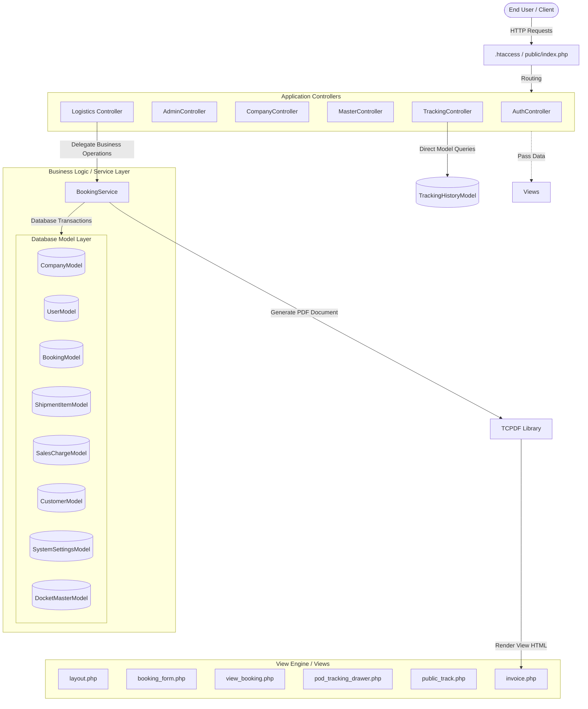

# MA Logistics ERP - Architectural Context & Development Log

## Overview
This document serves as the central, comprehensive architectural context for the MA Logistics ERP application (Phase 2). It combines system overview, technology stack, directory structure, database schema, design guidelines, detailed formulas, API endpoints, deployment checklists, and a detailed historical log of all features, tweaks, bug fixes, and modifications. Use this file as the single source of truth for the project.

---

## 1. High-Level System Architecture & Tech Stack

The MA Logistics ERP is built using a clean **Model-View-Controller (MVC)** pattern on top of CodeIgniter 4. It leverages a **Service Layer** to isolate complex business actions, ensuring code clarity, modularity, and maintainability.



### Technical Stack
* **Framework**: [CodeIgniter 4](https://codeigniter.com) (PHP 8.x)
* **Database**: MySQL / MariaDB
* **Frontend UI & Theme**: Bootstrap 5, jQuery 3.x, and Vanilla JavaScript
* **Dynamic UX**: SweetAlert2 (for interactive confirmation popups and navigation intercept traps)
* **PDF Generation**: [TCPDF Library](https://tcpdf.org)
* **Signature Canvas**: HTML5 Canvas API (stores signatures as Base64 images directly inside `/public/uploads/signatures/`)

---

## 2. Key Directory & Code Map

### Controllers
* [AuthController.php](file:///D:/Company%20Work/Company%20projects/MAlogistic%20phase%202/app/Controllers/AuthController.php): Session creation, authentication checks, and user login/logout loops.
* [AdminController.php](file:///D:/Company%20Work/Company%20projects/MAlogistic%20phase%202/app/Controllers/AdminController.php): Administrative user management, system permissions, and creation/deletion of company accounts.
* [CompanyController.php](file:///D:/Company%20Work/Company%20projects/MAlogistic%20phase%202/app/Controllers/CompanyController.php): Company settings, signature upload directories, and global configuration overrides.
* [MasterController.php](file:///D:/Company%20Work/Company%20projects/MAlogistic%20phase%202/app/Controllers/MasterController.php): CRUD processes for Customers, Drivers, Transporters, Airlines, Locations, and generic Lookups.
* [Logistics.php](file:///D:/Company%20Work/Company%20projects/MAlogistic%20phase%202/app/Controllers/Logistics.php): Core controller for AWBs, dynamic datatables, and invoice TCPDF builders.
* [TrackingController.php](file:///D:/Company%20Work/Company%20projects/MAlogistic%20phase%202/app/Controllers/TrackingController.php): CRUD handlers for transit status logs, POD uploads, and public tracking views.

### Services
* [BookingService.php](file:///D:/Company%20Work/Company%20projects/MAlogistic%20phase%202/app/Services/BookingService.php): Houses transactional database logics for `createBooking` and `updateBooking`. Handles Base64 signature image compilation, docket/AWB duplication guards, grid sync, and audit logging hooks.

### Models
* [CompanyModel.php](file:///D:/Company%20Work/Company%20projects/MAlogistic%20phase%202/app/Models/CompanyModel.php): Multi-tenant corporate structure.
* [UserModel.php](file:///D:/Company%20Work/Company%20projects/MAlogistic%20phase%202/app/Models/UserModel.php): System operators and permission flags.
* [BookingModel.php](file:///D:/Company%20Work/Company%20projects/MAlogistic%20phase%202/app/Models/BookingModel.php): Core structure representing AWB tickets.
* [ShipmentItemModel.php](file:///D:/Company%20Work/Company%20projects/MAlogistic%20phase%202/app/Models/ShipmentItemModel.php): Line items tracking weight, dimensions, and customer-docket relations.
* [SalesChargeModel.php](file:///D:/Company%20Work/Company%20projects/MAlogistic%20phase%202/app/Models/SalesChargeModel.php): Breakdown of financial fees.
* [SystemSettingsModel.php](file:///D:/Company%20Work/Company%20projects/MAlogistic%20phase%202/app/Models/SystemSettingsModel.php): Dynamic configurations per company (e.g., volumetric divisor).
* [DocketMasterModel.php](file:///D:/Company%20Work/Company%20projects/MAlogistic%20phase%202/app/Models/DocketMasterModel.php): Registry of active dockets for unique validations.
* [TrackingHistoryModel.php](file:///D:/Company%20Work/Company%20projects/MAlogistic%20phase%202/app/Models/TrackingHistoryModel.php): Chronological log of transit updates per booking.

---

## 3. Database Schema & Key Relationships

```
 companies (1) --------< (N) bookings (1) --------< (N) shipment_items (N)
                              |                               |
                              |--- (1) : (1) sales_charges    |--- (1) : (0..1) docket_master
                              |                               
                              |--------< (N) tracking_history
```

### Key Database Tables

| Table Name | Description | Key Columns |
| :--- | :--- | :--- |
| `companies` | Multi-tenant groups. | `id`, `name`, `gstin`, `pan`, `sac_code`, `cgst_rate`, `sgst_rate`, `igst_rate`, `signature_path` |
| `users` | User credentials and permission roles. | `id`, `username`, `password`, `role` (admin/user), `can_create`, `can_edit`, `can_delete` |
| `bookings` | Main AWB dispatch records. | `id`, `awb_no`, `company_id`, `booking_date`, `origin`, `destination`, `mode_transport`, `status`, `gst_applied`, `signature_path` |
| `shipment_items` | Individual packages / dockets under an AWB. | `id`, `booking_id`, `customer_name`, `bill_to`, `consignee`, `docket_no`, `invoice_no`, `actual_weight`, `volumetric_weight`, `final_chargeable_weight`, `pieces` |
| `sales_charges` | Financial fees assigned per booking. | `id`, `booking_id`, `rate`, `weight`, `ddc`, `ssc`, `btc`, `flc`, `doc`, `inbound_tsp`, `total_amount` |
| `tracking_history` | Historical transit coordinates and POD. | `id`, `booking_id`, `current_location`, `status`, `event_date`, `event_time`, `remarks`, `proof_image` |
| `audit_logs` | Logs weight overrides and lifecycle changes. | `id`, `table_name`, `record_id`, `field_name`, `old_value`, `new_value`, `changed_by` |
| `system_settings` | Custom variable storage (e.g. volumetric divisor). | `id`, `company_id`, `setting_key`, `setting_value` |
| `docket_master` | Validates duplicate dockets in real-time. | `id`, `docket_no`, `company_id`, `booking_id`, `shipment_item_id` |

---

## 4. Core Functional Modules & Business Logic

### 🏢 Multi-Tenant Company Isolation
* The active company context is selected upon user login and retained in the session as `selected_company_id`.
* Every database record is dynamically filtered and isolated per company.
* Settings allow configuring Company details (GSTIN, PAN, SAC Code, CGST/SGST/IGST tax rates) and uploading a digital signature.

### 🗂️ Master Data Accordion
Masters are managed inside a dedicated collapsable accordion in the sidebar (configured in [layout.php](file:///D:/Company%20Work/Company%20projects/MAlogistic%20phase%202/app/Views/layout.php)):
1. **Customer Master**: Detailed company billing addresses, contact info, and state-specific GST details.
2. **Driver Master**: Driver names, mobile numbers, and license numbers.
3. **Transporter Master**: Third-party transporter details for road cargo.
4. **Airline Master**: Carrier databases for air cargo.
5. **Lookup Values**: Drop-down option lists (Origins, Destinations, Material Types, Categories, Transport Modes, and Payment Types).

### 📝 Logistics Booking Module (AWB / Docket)
* Managed via [Logistics.php](file:///D:/Company%20Work/Company%20projects/MAlogistic%20phase%202/app/Controllers/Logistics.php) and [booking_form.php](file:///D:/Company%20Work/Company%20projects/MAlogistic%20phase%202/app/Views/logistics/booking_form.php).
* Enforces unique AWB numbers and unique Docket numbers per company context.

### 📊 Dynamic Shipment Items Grid
* **Volumetric Calculations**: Inputting Dimensions ($Length \times Width \times Height$ in cm) computes the Volumetric Weight using a setting-based divider (default: `/6000`).
* **Chargeable Weight**: Calculates $max(Actual\ Weight, Volumetric\ Weight)$.
* **Manual Overrides**: Overriding the chargeable weight manually logs the action in the `audit_logs` table (using `logAudit` in [BookingService.php](file:///D:/Company%20Work/Company%20projects/MAlogistic%20phase%202/app/Services/BookingService.php)).
* **JSON Sync**: The grid serialization uses a single hidden JSON textarea (`items_json`) on form submission.

### 💰 Financials & Invoicing
* **Sales Charges**: Breakdown sheet capturing Base Rate and 20+ additional charges.
* **PDF Invoicing**: Compiles shipment grids, calculates CGST/SGST/IGST dynamically, applies the signature, and exports a TCPDF layout ([invoice.php](file:///D:/Company%20Work/Company%20projects/MAlogistic%20phase%202/app/Views/pdfs/invoice.php)).

### 📍 Tracking System & POD Workflow
* **AWB Transit Events**: Staff can append chronological status updates (Location, Status, Date, Time, Remarks) to a booking.
* **Proof of Delivery (POD)**: Supports physical photo uploads or capturing signatures dynamically using a SweetAlert signature canvas.
* **Public Tracking Portal**: Real-time tracking without login via [public_track.php](file:///D:/Company%20Work/Company%20projects/MAlogistic%20phase%202/app/Views/public_track.php).

---

## 5. Formulas & Calculation Specifications

### Volumetric & Chargeable Weight
* **Volumetric Weight**:
  $$\text{Volumetric Weight (kg)} = \frac{\text{Length (cm)} \times \text{Width (cm)} \times \text{Height (cm)}}{\text{Volumetric Formula (default: 6000)}}$$
* **Chargeable Weight (Per Item)**:
  $$\text{Chargeable Weight (kg)} = \max(\text{Actual Weight}, \text{Volumetric Weight})$$

### Surcharges & Taxable Amounts (Frontend Form)
* **Base Freight Charge**:
  $$\text{Base Freight Charge} = \text{Sales Rate} \times \text{Total Chargeable Weight}$$
* **Total Taxable Amount**:
  $$\text{Total Taxable Amount} = \text{Base Freight Charge} + \sum \text{Surcharges}$$
  *(Surcharges include ADO, Admin Charges, AWB Carrier/Agent Fees, Inbound/Outbound Storage/Handling, TSP, Utility, X-Ray, etc.)*

### GST & Net Payable Calculations
If **GST Applied** is checked on the booking:
* **CGST Amount**: $\text{round}(\text{Total Taxable Amount} \times \frac{\text{Company CGST Rate}}{100})$
* **SGST Amount**: $\text{round}(\text{Total Taxable Amount} \times \frac{\text{Company SGST Rate}}{100})$
* **IGST Amount**: $\text{round}(\text{Total Taxable Amount} \times \frac{\text{Company IGST Rate}}{100})$
* **Net Payable**: $\text{Total Taxable} + \text{CGST} + \text{SGST} + \text{IGST}$

---

## 6. API Reference Summary

### A. Public Shipment Tracking
* **URL**: `/api/track/{awb_or_docket_no}`
* **Method**: `GET`
* **Access**: Public (CORS Enabled)
* **Response Output**: Returns a JSON object containing the current AWB status, consignee, delivery logs, expected date, and chronological history tracking items.

### B. Internal Master Data APIs (CORS Disabled, Requires Login Session Cookie)
* **GET** `/api/masters/customers`: List of active customers.
* **GET** `/api/masters/customers/{id}`: Payment type, code, currency, and GST details of customer.
* **GET** `/api/masters/transporters`: List of active transporters.
* **GET** `/api/masters/drivers`: List of active drivers.
* **GET** `/api/masters/airlines`: List of active airlines.
* **GET** `/api/masters/lookup/{type}`: Options by lookup categories (e.g. origins, destinations, payment types).
* **GET** `/api/masters/company-gst`: The CGST/SGST/IGST rates for the active company context.

### C. Tracking & POD Operations
* **GET** `/tracking/history/{booking_id}`: Retreives all logged events.
* **POST** `/tracking/save`: Creates a new transit log or uploads POD image (JPEG/PNG) via `multipart/form-data`.
* **POST** `/tracking/delete/{id}`: Deletes event and synchronizes the current status to the next latest log.

---

## 7. Production Deployment & Scaling Guidelines

### ⚙️ Server Configurations (Targeting 50+ Concurrent Users)
* **PHP-FPM (`/etc/php/8.x/fpm/pool.d/malogistic.conf`)**:
  ```ini
  pm = dynamic
  pm.max_children = 80          ; Sizing: (RAM for PHP) / (avg MB per worker)
  pm.start_servers = 10
  pm.min_spare_servers = 10
  pm.max_spare_servers = 20
  pm.max_requests = 500
  request_terminate_timeout = 60s
  ```
* **MySQL (`my.cnf`)**:
  ```ini
  max_connections = 200          ; Must exceed pm.max_children + replicas
  innodb_buffer_pool_size = 1G   ; Scale with 50-70% of dedicated RAM
  wait_timeout = 300
  ```
* **Session Handler Migrations**:
  - For small scale: File sessions (`FileHandler`) instead of DB.
  - For high scale (50+ concurrent users): Redis sessions via `Session.php` driver `RedisHandler` to prevent database table lockups.

### 🚀 Go-Live Release Checklist
- [ ] Set `CI_ENVIRONMENT = production` in `.env`
- [ ] Configure `chmod -R 775 writable/` (writable session, cache, logs, uploads folders)
- [ ] Execute migrations: `php spark migrate`
- [ ] Restart PHP-FPM and MySQL services
- [ ] Purge seed performance test data: `php spark loadtest:purge --company 1`
- [ ] Verify CSRF form integration and Datatable page query batch speed.

---

## 8. Development History & Session Logs

### Frontend Refactoring & Design Fixes
* **Standardized Form Dropdowns**: Stripped out the Select2 JS and CSS libraries. Restored data-heavy dropdowns (Origin, Destination, Transporters, Drivers, Airlines, Payment Type, Transport Mode, Consignor) to use clean, standard Bootstrap `<select>` tags (`form-select form-select-sm`) to support fast tab-navigation.
* **Sidebar Reorganization & Accordion UI**: Replaced absolute-positioned Bootstrap dropdowns in [layout.php](file:///D:/Company%20Work/Company%20projects/MAlogistic%20phase%202/app/Views/layout.php) with Bootstrap "Collapse" Accordion components. Organized master links under a dedicated **"Masters"** accordion.
* **Fluid Responsive Layout**: Replaced fixed-width `<div class="container">` wrappers with `<div class="container-fluid">` across management screens, search pages, views, and settings, enabling 100% horizontal stretch on Ultrawide screens.

### Advanced UX: Navigation Interception
* **SweetAlert2 Navigation Trap**: Implemented a global form changes listener (`$('input, select, textarea').on('change input')`) to manage the `isDirty` state in [booking_form.php](file:///D:/Company%20Work/Company%20projects/MAlogistic%20phase%202/app/Views/logistics/booking_form.php). Suppressed default link navigation to trigger a custom SweetAlert2 prompt. Implemented a history push-state back-button trap (`popstate` listener) to intercept browser back actions, using a native `beforeunload` fallback only for full tab closure or page refresh.

### Database & Backend Data Flow Fixes
* **The "Hidden Data" Bug (is_active Filter)**: Fixed an issue where newly created master records did not populate dropdown options because they defaulted to `is_active = 0` or `NULL`. Removed the `->where('is_active', 1)` conditions from [CustomerModel.php](file:///D:/Company%20Work/Company%20projects/MAlogistic%20phase%202/app/Models/CustomerModel.php), [TransporterModel.php](file:///D:/Company%20Work/Company%20projects/MAlogistic%20phase%202/app/Models/TransporterModel.php), [DriverModel.php](file:///D:/Company%20Work/Company%20projects/MAlogistic%20phase%202/app/Models/DriverModel.php), [AirlineModel.php](file:///D:/Company%20Work/Company%20projects/MAlogistic%20phase%202/app/Models/AirlineModel.php), and [LookupValueModel.php](file:///D:/Company%20Work/Company%20projects/MAlogistic%20phase%202/app/Models/LookupValueModel.php).
* **Airlines Dropdown Variable Typo**: Corrected [booking_form.php](file:///D:/Company%20Work/Company%20projects/MAlogistic%20phase%202/app/Views/logistics/booking_form.php) which wrongly looked for `$lookups['airlines']` instead of the root `$airlines` variable passed by the controller.
* **Unused "Sort Order" Removal**: Stripped the "Sort Order" UI input field and database column from Lookup Values. Removed insert logic, cleaned up `$allowedFields` in [LookupValueModel.php](file:///D:/Company%20Work/Company%20projects/MAlogistic%20phase%202/app/Models/LookupValueModel.php), and dropped the database column permanently via SQL (`ALTER TABLE lookup_values DROP COLUMN sort_order;`).

### Bug Fixes
* **The Logout Crash (Undefined variable $success)**: Fixed an `ErrorException: Undefined variable $success` in [layout.php](file:///D:/Company%20Work/Company%20projects/MAlogistic%20phase%202/app/Views/layout.php) during logouts. Moved flash variables (`$success`, `$error`, `$info`) outside the authenticated session block so they evaluate safely on the guest login layout.

### Recent Feature Additions
* **Database Updates**: Added `system_settings` table (for global variables like volumetric divisor), `location_master` table, and expanded customer tables to hold billing details and state GST locations.
* **Frontend Modularization**: Extracted repeated client-side helper logic into `public/js/erp-utils.js` and split the customer form layouts into a partial: `app/Views/masters/_customer_form_fields.php`.
* **Company Settings & Invoices**: Configured [CompanyController.php](file:///D:/Company%20Work/Company%20projects/MAlogistic%20phase%202/app/Controllers/CompanyController.php) to support custom logo and signature uploads. Enhanced [invoice.php](file:///D:/Company%20Work/Company%20projects/MAlogistic%20phase%202/app/Views/pdfs/invoice.php) to draw signatures and compute GST parameters based on company tax policies.
