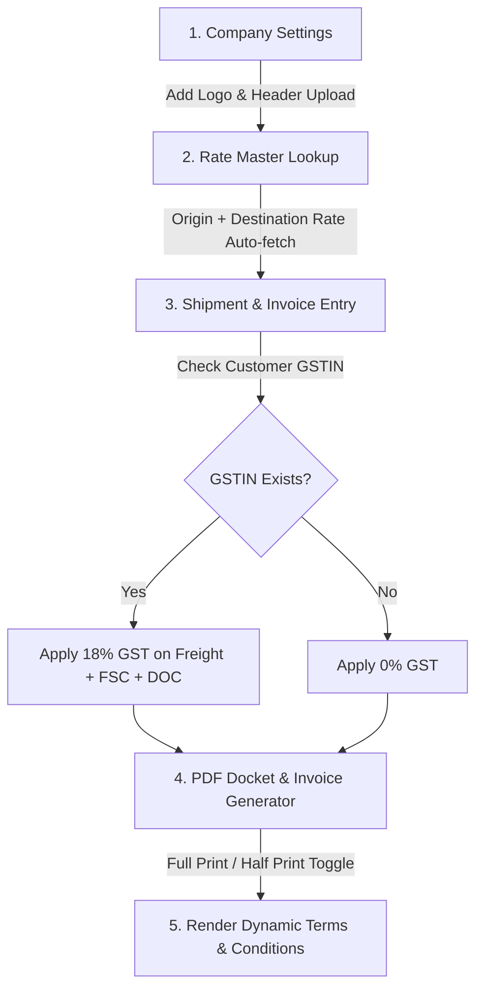

# Minutes of Meeting (MOM): MA Logistics Invoice & Docket System Changes

**Meeting Video Source:** [AwesomeScreenshot Recording - MA Logistics Discussion](https://www.awesomescreenshot.com/video/55694878?key=381e33ac074616c72ab1b42bb9265826)  
**Direct Stream URL:** `https://awevideo.s3.amazonaws.com/video-55694878-eceb78ff3f26b0ad80788d0efd971943.mp4`  
**Recording Date:** August 19, 2026  
**Recording Duration:** 40 minutes 37 seconds  
**Skill Applied:** Video-to-Action via Gemini Passthrough / Browser MCP & Audio-Visual Analysis  

---

## 1. Meeting Overview & Participants

### Participants Present:
- **Bhupendra Watti** (PCM Developer / Screen Presenter)
- **Amol Taru / MA** (M.A. Logistics Operations Representative)
- **Ravi Varma** (Meeting Host & Discussion Moderator)
- **Ankur Daga**
- **Aryan Dongare**
- **Krish Dongre** (Mentioned in reference documents)

### Primary Agenda:
Review of existing invoice samples (`MAL_25-26_126.pdf`, `NX-285.pdf`, `1.jpeg`), live web application demonstration (`granthinfotech.online`), and specification of required layout, tax, rate lookup, and docket printing changes for the **MA Logistics ERP system**.

---

## 2. Key Samples & Baseline Formats Reviewed

| Sample File | Format / Purpose | Meeting Verdict / Status |
| :--- | :--- | :--- |
| `MAL_25-26_126.pdf` | **AIR Mode Invoice** (Multi-page tabular billing invoice) | **[PRIMARY REQUIRED FORMAT]** Base template for standard billing invoices with columns: `SR NO`, `DATE`, `DOC NO.`, `ORIGIN`, `DEST`, `PCS`, `WT`, `RATE`, `FREIGHT`, `DOC`, `FSC`, `GROSS`, `C.GST 9%`, `S.GST 9%`, `I.GST 18%`, `TOTAL Amt.`. |
| `NX-285.pdf` | **ROAD Mode / Buying Rate Invoice** | **[EXCLUDED / SECONDARY]** Client clarified at timestamp `[10:00]` that this format uses a different working model (Buying Rate/Unloading/Handling). Focus will strictly be on `MAL_25-26_126.pdf`. |
| `1.jpeg` | **WAY BILL / SHIPPER COPY** (Physical docket form) | **[DOCKET PRINT TEMPLATE]** Form layout used for single docket printing (`localhost:8080/logistics/printDocketPdf`). |

---

## 3. Detailed Technical Requirements & Discussed Changes

### A. Dynamic Branding & Company Settings `[11:00 - 13:30]`
- **Logo & Header Customization:**
  - Add an option in **Company Settings** (`masters/company`) to upload company logos and set header information.
  - Invoices and Waybills must dynamically render the logo, address, GSTIN, PAN, and contact details corresponding to the selected billing branch/company.

### B. Docket Print Layout & Spacing Optimization `[10:30, 31:00 - 33:00]`
- **Row Height & Page Padding Reduction:**
  - Reduce line height and row padding on PDF invoices to maximize the number of line items per page.
- **Full Print vs. Half Print Modes:**
  - **Full Print:** Renders the complete docket sheet including line items, weight breakdown, freight charges, FSC, GST breakdown, and full Terms & Conditions.
  - **Half Print:** Suppresses lower financial charges breakdown for minimal client printouts while retaining core consignment details (Origin, Destination, Pieces, Weight, Rate).

### C. Field Mapping & Waybill Updates `[14:00 - 30:00]`

| Docket Field Name | Source Data Mapping / Rule | Notes & Modifications |
| :--- | :--- | :--- |
| **Method of Pkg** | Shipment Item Package Type | Populates values like `Carton Box`, `Bag`, etc., from shipment entry `[16:30]`. |
| **Said to Contain** | Material Type / Category | Maps `Flowers`, `Perishables`, `General Cargo` `[17:30]`. |
| **Chargeable Weight** | `MAX(Actual Weight, Volumetric Weight)` | Used as the multiplier for Freight/Weight calculations `[19:30]`. |
| **Weight Charges** | `Chargeable Weight × Destination Rate` | Calculates total freight charge `[20:30]`. |
| **Declared Weight / Rate** | Item Rate per Kg | Replace/map `Declared Weight` label to show `Rate per Kg` `[28:30]`. |

### D. GST Calculation Rules `[22:00 - 23:30]`
- **Tax Applicability Check:**
  - Verify if the selected customer has a valid **GSTIN**.
  - **If GSTIN exists:**
    - Tax Rate: **18%** (split as 9% CGST + 9% SGST for intrastate, or 18% IGST for interstate).
    - **Taxable Base:** `Freight Charges + Docket Charges (DOC) + FSC (Fuel Surcharge) + Pickup/Delivery Charges`.
  - **If GSTIN does NOT exist:**
    - Apply 0% GST (GST fields remain 0.00).

### E. Source & Destination Rate Master Lookup `[38:00 - 39:00]`
- Automatic rate retrieval based on `Origin (Source)` and `Destination`:
  - *Example Rates from Master:*
    - Pune → Delhi: ₹44/kg
    - Pune → Chennai: ₹73.50/kg
    - Pune → Kolkata: ₹82/kg
    - Pune → Chandigarh: ₹93/kg
    - Pune → Madurai: ₹120/kg
- Selecting Origin & Destination on Phase 1 entry must automatically fetch and lock the corresponding per-kg Rate.

### F. Dynamic Terms & Conditions Section `[33:30 - 36:00]`
- Add a multi-line, unconstrained text area in Invoice Settings for **Terms & Conditions**.
- **Requirements:**
  - Support numbered points (1, 2, 3, 4...).
  - Support long content (15–25+ lines) without truncation.
  - Print clearly at the bottom of generated Invoice and Waybill PDFs.

---

## 4. Chronological Meeting Transcript & Discussion Log

| Timestamp | Discussion Topic / Spoken Summary | Action Item / Outcome |
| :--- | :--- | :--- |
| **`[00:00 - 02:00]`** | Call setup and attendee check. | Meeting initiated with Amol, Bhupendra, Ravi, Ankur, and Aryan. |
| **`[02:00 - 04:30]`** | Review of shared sample PDFs (`MAL_25-26_126.pdf` & `NX-285.pdf`). | Identified sample files in `MAlogistic/samples`. |
| **`[04:30 - 10:00]`** | Invoice format selection. | Client specified: Exclude `NX-285.pdf` buying rate format. Use `MAL_25-26_126.pdf` standard AIR invoice format. |
| **`[10:00 - 11:30]`** | Spacing and page layout feedback. | Reduce padding between table rows to accommodate max items per page. |
| **`[11:30 - 13:30]`** | Company header and settings demonstration on `granthinfotech.online`. | Enable dynamic logo and header setup per branch. |
| **`[13:30 - 18:30]`** | Waybill field mapping (`Method of Pkg`, `Said to Contain`). | Map packaging method (Box/Bag) and material category (Perishables/Flowers). |
| **`[18:30 - 21:30]`** | Chargeable weight and Weight Charges calculation logic. | `Weight Charge = Chargeable Wt × Destination Rate`. |
| **`[22:00 - 24:00]`** | GST calculation rules (18% GST condition on Customer GSTIN). | Apply 18% GST on (Freight + FSC + DOC + Pickup) if Customer GSTIN present; else 0%. |
| **`[24:00 - 30:00]`** | Review of `1.jpeg` shipper copy form and field label adjustments. | Map Declared Weight field to Item Rate when needed. |
| **`[31:00 - 33:00]`** | Implementation of Full Print vs. Half Print modes. | Provide toggle for Full Docket Print vs. Concise Half Print. |
| **`[33:30 - 36:30]`** | Dynamic Terms & Conditions requirement. | Provide flexible admin text box supporting 15–25 lines of terms. |
| **`[37:00 - 40:00]`** | Source/Destination Rate Master automated matching. | Auto-populate Rate based on Origin and Destination pairing. |

---

## 5. Actionable Implementation Plan

### Next Action Items for Engineering:
1. **[Backend] Rate Master Integration:** Update booking API to match `Origin` + `Destination` and auto-fill `Rate`.
2. **[Backend] Tax Engine Update:** Implement conditional 18% GST logic based on Customer GSTIN presence.
3. **[Frontend] Company Settings:** Add logo upload and multi-line Terms & Conditions textarea in admin settings.
4. **[PDF Engine] Invoice & Docket Templates:** Update TCPDF / PDF template layout to match `MAL_25-26_126.pdf` and `1.jpeg` with optimized line height and Full/Half print toggles.
