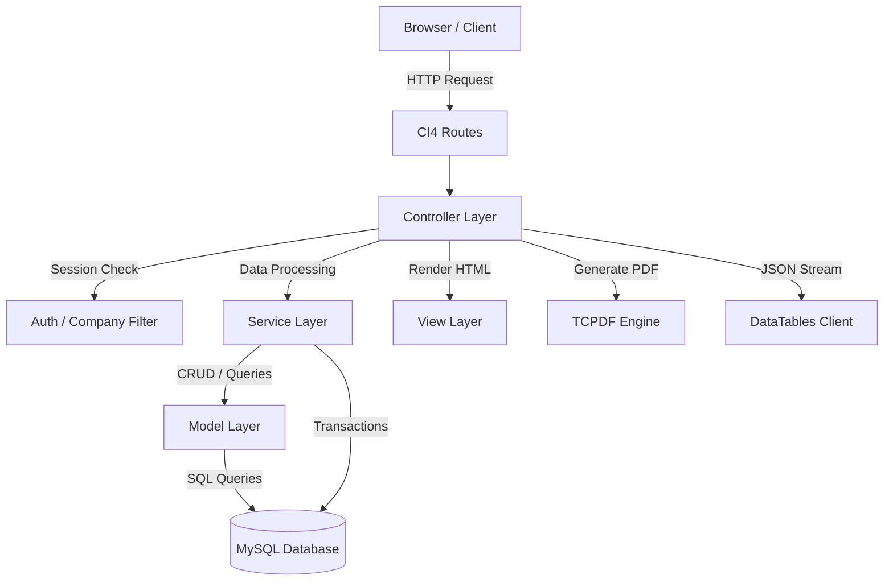

# M.A. Logistics ERP — System Architecture

This document describes the software architecture, system flow, design patterns, security model, and component integration of M.A. Logistics ERP.

---

## 1. MVC & Service Layer Pattern

The application strictly implements the **Model-View-Controller (MVC)** architectural pattern enhanced with a **Service Layer**.



### Layer Responsibilities
* **Controllers (`app/Controllers/`)**: Handle HTTP routing, input validation, request parsing, session checks, and response formatting (HTML views or JSON responses).
* **Service Layer (`app/Services/`)**: `BookingService` encapsulates booking calculations and persistence. `CustomerRateService` owns customer/rate transaction boundaries, locks the tenant-scoped customer row as a per-customer mutex, closes immutable versions, and handles idempotent/conflicting runtime saves.
* **Models (`app/Models/`)**: CodeIgniter Entity/Model wrappers executing parameterized SQL queries, field casting, and validation rules against MySQL database tables.
* **Views (`app/Views/`)**: Modular PHP templates rendering Bootstrap-based responsive layouts (`layout.php`), form partials, dashboard DataTables grids, and TCPDF HTML layouts.

---

## 2. Authentication, Authorization & Session Management
* **Authentication**: Native CI4 session-based authentication storing `user_id`, `role`, and `selected_company_id`.
* **Multi-Company Isolation**: Every data retrieval query filters by `company_id = session('selected_company_id')`.
* **Session Storage Architecture**:
  * Default: `FileHandler` (`writable/session`).
  * `.env` intentionally leaves `session.savePath` unset so `Config\Session::$savePath = WRITEPATH . 'session'` remains authoritative; deployment must verify that directory exists and is writable.
  * Production Scaling: Supports `RedisHandler` via `.env` configuration to avoid MySQL database lock contention during concurrent user sessions.
* **CSRF Protection**: Form submit tokens and AJAX headers match unified `csrf_token_name`.

---

## 3. PDF Generator Architecture & Dual Invoice Engine

### TCPDF Engine Integration
PDF documents are rendered dynamically via `TCPDF` inside `Logistics::exportPdf()` and `Logistics::exportDocketPdf()`. The system supports a **Dual Invoice Output Engine**:
1. **AWB Invoice (All Invoices Summary)**: Multi-page tabular billing layout (`app/Views/pdfs/invoice.php`) matching sample `MAL_25-26_126.pdf`. Renders top-left company logo, compact line spacing, and multi-line Terms & Conditions.
2. **Docket Bill (Individual Shipper Copy)**: Single-page docket waybill (`app/Views/pdfs/docket_pdf.php`) matching sample `1.jpeg`. Supports **Full Print** (full financial breakdown) and **Half Print** (`print_mode=half` suppressing charge amounts for clean delivery slips).

### Dynamic Branding & Uploaded Assets
- **Company Logo Storage**: Uploaded company logo images are validated in `CompanyController` and stored in `public/uploads/logos/` with paths saved to `companies.logo_path`. Both PDF templates check `FCPATH . $logoPath` and dynamically render the branding image in the document header.

### Layout Stability (Option C Architecture)
To prevent table cell height blowouts when dynamic Terms & Conditions expand, the invoice footer section is rendered using independent side-by-side sub-tables ($60\%$ left for T&C / $40\%$ right for Signature):

```html
<table style="width: 100%; border: none;">
  <tr>
    <td style="width: 60%; vertical-align: top; border: 1px solid #000;">
       <!-- Sub-table: Dynamic Terms & Conditions -->
    </td>
    <td style="width: 40%; vertical-align: top; border: 1px solid #000;">
       <!-- Sub-table: Digital Signature & Authorised Signatory -->
    </td>
  </tr>
</table>
```

---

## 4. Datatables & Server-Side Pagination
The booking list grid in `manage_bookings.php` uses server-side processing via `Logistics::ajaxDatatable()`.
* **Optimization**: Batch joins and index `idx_bookings_company_id (company_id, id DESC)` guarantee sub-100ms response times for $100,000+$ booking records.
