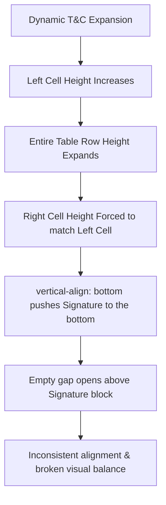

# Architectural Investigation: PDF Invoice Generator Layout Stability

This report details the architectural layout investigation of the PDF Invoice Generator for the **M.A. Logistics ERP (MARL EXPRESS ERP)**. It diagnoses the root causes of layout fragility when dynamic Terms & Conditions scale, compares PDF rendering engine constraints, and outlines production-safe layout strategies.

---

## 1. Root Cause Analysis
The observed alignment break when Terms & Conditions expand from a few lines to five or more is caused by the fundamental behavior of HTML table rendering within older HTML-to-PDF engines (specifically **TCPDF**'s `writeHTML` implementation).



### Technical Factors:
1. **Tallest-Cell Rule**: In standard HTML tables, a table row (`<tr>`) always inherits the height of its tallest child cell (`<td>`). When the left cell (Terms & Conditions) expands vertically, the right cell (Signature block) is forced to expand to the exact same pixel height.
2. **Vertical Alignment Traps**: The signature block uses `vertical-align: bottom`. As the row height increases, the signature elements are pushed further down to the cell's physical bottom, leaving a growing, empty white gap between the table borders and the signature contents.
3. **Implicit Line Height**: Without explicit styling, `<br>` tags and paragraph wraps generate non-standard line spacing in TCPDF, compounding the vertical height expansion.

---

## 2. PDF Engine Analysis
HTML-to-PDF rendering engines parse and compile CSS rules differently. The table below evaluates layout stability across major engines for this specific use case:

| Feature / Behavior | TCPDF (Current Engine) | mPDF | DomPDF |
| :--- | :--- | :--- | :--- |
| **CSS Box Model Support** | **Very Poor** (Relies on basic HTML3/4 tags. Floats and flexbox are ignored). | **Good** (Supports CSS floats, absolute positioning, margins, and padding). | **Excellent** (Strong compliance with modern CSS 2.1/3 box models). |
| **Table Cell Height Constraints** | **Fragile** (Ignores fixed `height` inside `<td>` if content exceeds it; does not support `max-height`). | **Moderate** (Respects fixed table heights; handles overflow with auto-wrapping). | **Stable** (Calculates table cell box boundaries cleanly). |
| **Page-Breaking Behavior** | **Dangerous** (Can split a single `<tr>` across pages, resulting in orphaned signature blocks or empty pages). | **Excellent** (Supports `page-break-inside: avoid` reliably on table rows). | **Moderate** (Handles page breaks well but can occasionally duplicate borders). |
| **Rendering Performance** | **Fast** (Lightweight memory usage but lacks advanced rendering capabilities). | **Slow** (Heavy memory footprints due to comprehensive CSS parsing). | **Moderate** (Good compromise, but slow on large datasets). |

---

## 3. Architecture Impact

Modifying the footer layout has direct implications for historical data, multi-tenant master data, and ERP performance:

* **Backward Compatibility**: Any change must support older bookings that contain empty or brief Terms & Conditions without creating vast white spaces or layout voids.
* **Dynamic Master Data Integrity**: The system must accommodate whatever text is saved in the **Company Master** without crashing the PDF compiler.
* **Multi-Page Escalation**: If T&C content exceeds one page, the entire document shifts from a single-page invoice to a multi-page invoice. The footer layout must either remain on the final page or replicate safely.

---

## 4. Future Scalability
The current row-based structure is **highly unstable** for future growth. If a future company registers with 10 or 20 terms, or includes dense legal clauses (e.g., Bank details, NEFT instructions, jurisdiction text):
1. **Vertical Blowout**: The single row will exceed the printable page margin, causing a critical crash or forcing TCPDF to generate an ugly second page with only the signature block.
2. **Visual Disconnection**: The signature block will sit completely detached from the main body of the invoice.

---

## 5. Recommended Solutions & Trade-off Analysis

Here is a ranked comparison of alternative layouts to solve the structural layout issue:

### Option A: Refined Single-Row Layout (Keep Current + Layout Adjustments)
Keeps the current table structure but optimizes T&C line spacing and replaces dynamic `<br>` wraps with tighter, inline list styling.
* **Pros**: $100\%$ backward-compatible; requires zero database or backend schema modifications.
* **Cons**: Still vulnerable to row expansion if terms grow excessively.
* **Regression Risk**: **Low**

### Option B: Fixed-Height Constraint Cells (`height: 120px;`)
Declares strict heights on both the left and right footer cells.
* **Pros**: Guarantees a stable visual layout for short or medium terms.
* **Cons**: **High risk of text truncation** in TCPDF if the terms exceed 120px. TCPDF does not support scrollbars or overflow styling, meaning text will simply clip and vanish.
* **Regression Risk**: **High** (Risk of legal text being cut off).

### Option C: Independent Side-by-Side Multi-Tables (Recommended)
Instead of placing T&C and Signature in the *same* table row, they are split into **two independent HTML tables** placed side-by-side using HTML widths (e.g., $60\%$ left, $40\%$ right).
```html
<table style="width: 100%; border: none;">
  <tr>
    <td style="width: 60%; vertical-align: top; border: 1px solid #000;">
       <!-- Independent Table for T&C -->
    </td>
    <td style="width: 40%; vertical-align: top; border: 1px solid #000;">
       <!-- Independent Table for Signature -->
    </td>
  </tr>
</table>
```
* **Pros**: 
  * Bridges the gap between side-by-side design and individual row safety.
  * The height of the T&C table can expand freely without pushing the Signature elements down.
  * Bypasses the tallest-cell inheritance rule.
* **Cons**: In TCPDF, nested table margins require careful padding adjustments to prevent double-border overlaps.
* **Regression Risk**: **Low to Medium**

### Option D: Stacked Block Layout (T&C Row followed by Signature Row)
Rearranges the layout so that the Terms & Conditions row spans the full $100\%$ width of the invoice, and the Signature block is placed in a clean, full-width or right-aligned row directly beneath it.
```
+-------------------------------------------------------------+
|                     Terms & Conditions                      |
|  1. ...   2. ...   3. ...                                   |
+-------------------------------------------------------------+
|                                        For M.A LOGISTICS    |
|                                        [Signature]          |
|                                        Authorised signatory |
+-------------------------------------------------------------+
```
* **Pros**: Maximum structural stability. Fully accommodates unlimited terms without any column alignment interference.
* **Cons**: Alters the traditional side-by-side look of the original invoice.
* **Regression Risk**: **Medium** (Visual layout change).

---

## 6. Recommended Solution Ranking

For a production-grade ERP system where layout consistency and dynamic content safety are critical, we rank the solutions as follows:

| Rank | Solution | Layout Stability | Content Safety | Maintainability | Recommendation |
| :---: | :--- | :---: | :---: | :---: | :--- |
| **#1** | **Option C: Independent Side-by-Side Tables** | **High** | **Excellent** | **High** | **Highly Recommended** (Best balance of keeping original side-by-side layout while isolating vertical height changes). |
| **#2** | **Option A: Refined Single-Row (Current)** | **Low** | **Good** | **High** | **Acceptable** (Safe only if T&C length is strictly constrained by admin controls). |
| **#3** | **Option D: Stacked Block Layout** | **Excellent** | **Excellent** | **High** | **Good Alternative** (If the client approves moving away from side-by-side look). |
| **#4** | **Option B: Fixed-Height Constraint** | **High** | **Poor** | **Low** | **Not Recommended** (High danger of truncation and text loss). |

---

## 7. Production Readiness Assessment
To implement **Option C (Independent Side-by-Side Tables)** in a production-ready, bulletproof manner:

1. **Cell Isolation**: Break the outer footer row into a single full-width cell (`<td colspan="16">`), and inside it, insert a borderless master table with two columns ($60\%$ and $40\%$).
2. **T&C List Wrapping**: Format T&C lines as an ordered list (`<ol>`) or clean block paragraphs rather than using continuous `<br>` wraps.
3. **Signature Box Integrity**: Keep the signature block in its own right-aligned cell inside the sub-table so it stays locked vertically without empty gap blowouts.
4. **Validation Guard**: In the **Company Master settings** panel (`masters/company_settings.php`), add a simple visual limit or character indicator to the T&C textarea to guide admins not to exceed 10 lines, protecting the physical height of standard print layouts.
