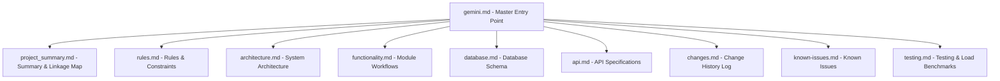
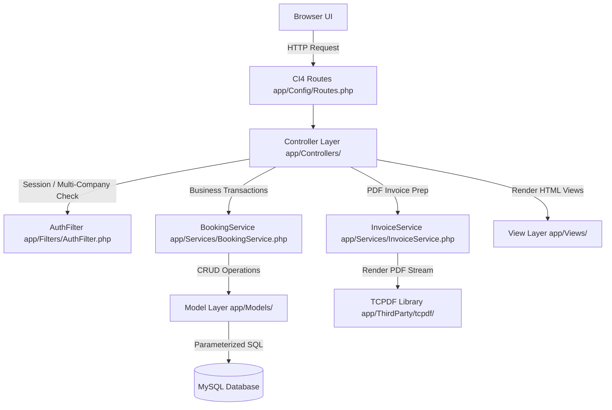
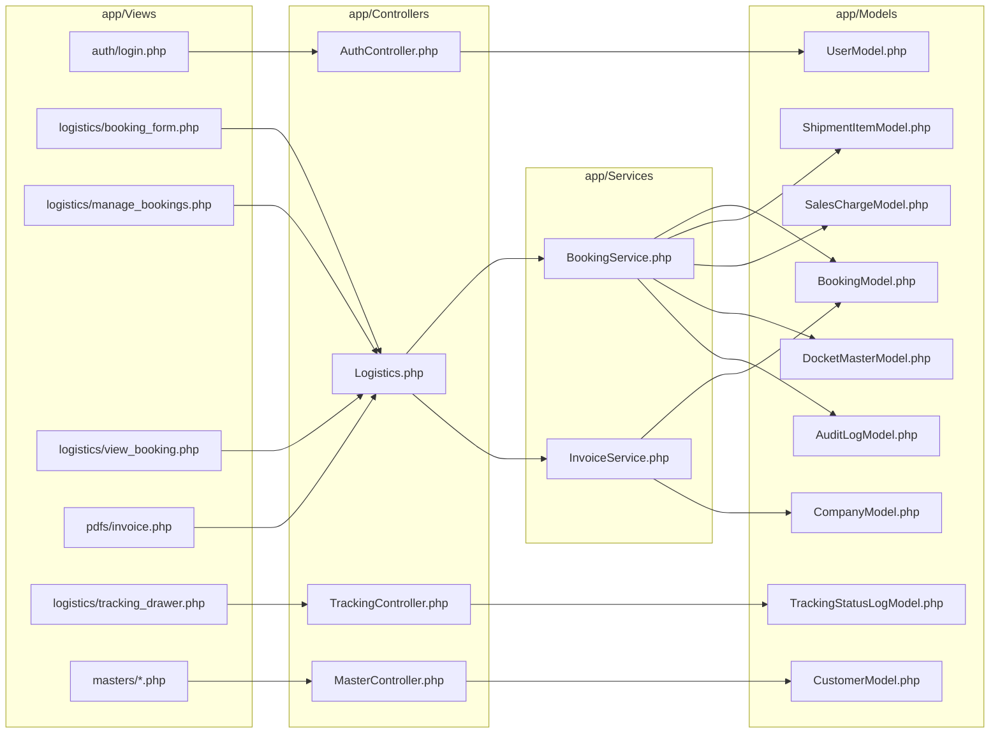

# M.A. Logistics ERP (MARL EXPRESS ERP) — Full Project Summary & Inter-File Linkage Map

This document provides a comprehensive summary of the **M.A. Logistics ERP (MARL EXPRESS ERP)** project, detailing the architecture, modules, documentation index, and the exact flow of how forms, views, controllers, services, models, and database tables link together.

---

## 1. Executive Project Summary & Technology Stack

**M.A. Logistics ERP** is a multi-tenant enterprise resource planning application designed for air freight and surface logistics operations.

### Key Features & Modules
* **Consignment Manifesting**: Create, edit, search, and view Air Waybills (AWBs) and Dockets.
* **Volumetric & Chargeable Weight Engine**:
  * Volumetric Weight $= \frac{L \times W \times H}{6000}$.
  * Chargeable Weight per item $= \max(\text{Actual Weight}, \text{Volumetric Weight})$.
  * Manual chargeable weight overrides logged directly to `audit_logs`.
* **Dynamic Surcharges & Custom Charges**:
  * 20+ standard sales surcharges (pickup, handling, TSP, TCP, fuel, X-ray, admin).
  * Dynamic item-level custom charges (`+ Add Charge`) and global booking surcharges (`+ Add Surcharge`).
* **Multi-Tenant Isolation**: Complete data segregation by `company_id` across session, queries, dropdowns, and reports.
* **Pixel-Perfect PDF Invoicing**: Horizontal A4 invoice generation using TCPDF with dynamic Terms & Conditions and digital signature uploads.
* **Live Courier Tracking & POD Management**: Internal tracking timeline drawer, proof-of-delivery (POD) signature/image uploads, and public CORS-enabled JSON API (`/api/track/{awb_no}`).

### Technology Stack
* **Backend Framework**: CodeIgniter 4 (PHP 8.x) adhering to MVC + Service Layer pattern.
* **Database**: MySQL with compound indexing (`idx_bookings_company_id`).
* **Frontend**: HTML5, Vanilla CSS, Bootstrap 5, DataTables.js, SweetAlert2 (`isDirty` unsaved change trap), and `public/js/erp-utils.js`.
* **PDF Generator**: TCPDF library implementing Option C side-by-side sub-table footer layout.

---

## 2. Documentation Architecture Index (`docs/`)

The system's documentation inside `docs/` is a permanent, synchronized part of the codebase:

| Document | File Path | Purpose |
| :--- | :--- | :--- |
| **`gemini.md`** | [gemini.md](file:///d:/Company%20Work/Company%20projects/MAlogistic/docs/gemini.md) | Master AI startup entry point and mandatory reading order. |
| **`project_summary.md`** | [project_summary.md](file:///d:/Company%20Work/Company%20projects/MAlogistic/docs/project_summary.md) | Full project summary and explicit inter-file & form linkage map. |
| **`README.md`** | [README.md](file:///d:/Company%20Work/Company%20projects/MAlogistic/docs/README.md) | Documentation reading directive and overview index. |
| **`rules.md`** | [rules.md](file:///d:/Company%20Work/Company%20projects/MAlogistic/docs/rules.md) | Permanent development rules, UX standards, and constraints. |
| **`architecture.md`** | [architecture.md](file:///d:/Company%20Work/Company%20projects/MAlogistic/docs/architecture.md) | System design, MVC flow, Service Layer, TCPDF layout architecture. |
| **`functionality.md`** | [functionality.md](file:///d:/Company%20Work/Company%20projects/MAlogistic/docs/functionality.md) | Business logic, calculations, smart carry-forward, GST toggles. |
| **`database.md`** | [database.md](file:///d:/Company%20Work/Company%20projects/MAlogistic/docs/database.md) | Full database table schemas, primary/foreign keys, model mappings. |
| **`api.md`** | [api.md](file:///d:/Company%20Work/Company%20projects/MAlogistic/docs/api.md) | Specifications for public tracking and internal master APIs. |
| **`known-issues.md`** | [known-issues.md](file:///d:/Company%20Work/Company%20projects/MAlogistic/docs/known-issues.md) | Bug registry, accepted workarounds, and resolution log. |
| **`testing.md`** | [testing.md](file:///d:/Company%20Work/Company%20projects/MAlogistic/docs/testing.md) | Smoke test plan, Python load testing suite, regression matrix. |
| **`changes.md`** | [changes.md](file:///d:/Company%20Work/Company%20projects/MAlogistic/docs/changes.md) | Implementation changelog ([CHG-001] to [CHG-014]) & Phase 2 matrix. |

---

## 3. High-Level Architecture & Communication Flow

---

## 4. Complete Inter-File & Form Linkage Map

The system components interact seamlessly across views, controllers, services, models, and database tables as detailed below.

---

### Step-by-Step Execution Flows

#### 1. Authentication & Multi-Company Context Flow
1. **User Request**: User accesses login form at [login.php](file:///d:/Company%20Work/Company%20projects/MAlogistic/app/Views/auth/login.php).
2. **Form Action**: POST `/auth/attemptLogin` $\rightarrow$ [AuthController.php](file:///d:/Company%20Work/Company%20projects/MAlogistic/app/Controllers/AuthController.php).
3. **Model Auth**: `AuthController` calls `UserModel::attemptLogin()` in [UserModel.php](file:///d:/Company%20Work/Company%20projects/MAlogistic/app/Models/UserModel.php) to verify credentials and auto-heal missing admin rules via `ensureDefaultAdmin()`.
4. **Company Selection**: Authenticated user selects active company at `/company-selection` $\rightarrow$ [company_selection.php](file:///d:/Company%20Work/Company%20projects/MAlogistic/app/Views/auth/company_selection.php).
5. **Session Filter**: [AuthFilter.php](file:///d:/Company%20Work/Company%20projects/MAlogistic/app/Filters/AuthFilter.php) intercepts all requests, storing `user_id`, `role`, and `selected_company_id` to enforce multi-tenant isolation.

---

#### 2. Consignment Entry (Booking Form) Flow
1. **Form Interface**: [booking_form.php](file:///d:/Company%20Work/Company%20projects/MAlogistic/app/Views/logistics/booking_form.php).
2. **Dropdown Data Population**:
   - Master fields (Customer, Consignor, Consignee, Origin, Destination, Carrier, Driver) load options via [MasterController.php](file:///d:/Company%20Work/Company%20projects/MAlogistic/app/Controllers/MasterController.php).
   - `MasterController` queries [CustomerModel.php](file:///d:/Company%20Work/Company%20projects/MAlogistic/app/Models/CustomerModel.php), [TransporterModel.php](file:///d:/Company%20Work/Company%20projects/MAlogistic/app/Models/TransporterModel.php), [DriverModel.php](file:///d:/Company%20Work/Company%20projects/MAlogistic/app/Models/DriverModel.php), [AirlineModel.php](file:///d:/Company%20Work/Company%20projects/MAlogistic/app/Models/AirlineModel.php), and [LookupValueModel.php](file:///d:/Company%20Work/Company%20projects/MAlogistic/app/Models/LookupValueModel.php).
3. **Item Drawer Modal & Smart Carry-Forward**:
   - Clicking `+ Add Package Item` opens the Offcanvas drawer modal.
   - Enter pieces, L×W×H, actual weight. Client-side math in [erp-utils.js](file:///d:/Company%20Work/Company%20projects/MAlogistic/public/js/erp-utils.js) calculates volumetric weight and chargeable weight ($\max(\text{Actual}, \text{Volumetric})$).
   - Dynamic per-item custom charges (`+ Add Charge`) append label+value inputs.
   - Saving an item serializes data into hidden field `#items_json` and automatically **copies forward** Customer, Bill To, Consignee, Docket No, Part No, and Invoice Date to the next drawer session.
4. **Sales Surcharges & GST Mechanics**:
   - Base Freight $=$ Sales Rate $\times$ Total Chargeable Weight.
   - Global surcharges (`+ Add Surcharge`) and standard fees carry class `.calc-surcharge`.
   - `#gst_applied` toggle reads company tax rates (`cgst_rate`, `sgst_rate`, `igst_rate`) from active company context ([CompanyModel.php](file:///d:/Company%20Work/Company%20projects/MAlogistic/app/Models/CompanyModel.php)).
   - `calcTotals()` instantly computes rounded taxes and updates Net Payable preview.
5. **Form Submission & Transaction**:
   - Submit POST `/logistics/store` or `/logistics/update/{id}` $\rightarrow$ [Logistics.php](file:///d:/Company%20Work/Company%20projects/MAlogistic/app/Controllers/Logistics.php).
   - Delegates transaction to [BookingService.php](file:///d:/Company%20Work/Company%20projects/MAlogistic/app/Services/BookingService.php):
     - Validates AWB & Docket uniqueness using [DocketMasterModel.php](file:///d:/Company%20Work/Company%20projects/MAlogistic/app/Models/DocketMasterModel.php).
     - Inserts record into `bookings` table via [BookingModel.php](file:///d:/Company%20Work/Company%20projects/MAlogistic/app/Models/BookingModel.php).
     - Inserts package rows into `shipment_items` table via [ShipmentItemModel.php](file:///d:/Company%20Work/Company%20projects/MAlogistic/app/Models/ShipmentItemModel.php).
     - Writes financial totals into `sales_charges` table via [SalesChargeModel.php](file:///d:/Company%20Work/Company%20projects/MAlogistic/app/Models/SalesChargeModel.php).
     - Logs manual chargeable weight overrides to `audit_logs` via [AuditLogModel.php](file:///d:/Company%20Work/Company%20projects/MAlogistic/app/Models/AuditLogModel.php).
   - Transaction commits $\rightarrow$ redirects to booking details view [view_booking.php](file:///d:/Company%20Work/Company%20projects/MAlogistic/app/Views/logistics/view_booking.php).

---

#### 3. Manage Bookings DataTables Grid Flow
1. **Grid Interface**: [manage_bookings.php](file:///d:/Company%20Work/Company%20projects/MAlogistic/app/Views/logistics/manage_bookings.php).
2. **Server-Side AJAX Processing**: DataTables issues `POST /logistics/ajaxDatatable` $\rightarrow$ `Logistics::ajaxDatatable()`.
3. **Query Optimization**: Runs an indexed query using `idx_bookings_company_id (company_id, id DESC)` on `bookings` for fast loading.
4. **Grid Actions**: Row buttons open View [view_booking.php](file:///d:/Company%20Work/Company%20projects/MAlogistic/app/Views/logistics/view_booking.php), Edit [booking_form.php](file:///d:/Company%20Work/Company%20projects/MAlogistic/app/Views/logistics/booking_form.php), PDF Invoice export, or Tracking Drawer.

---

#### 4. PDF Invoice Generation Flow
1. **Trigger**: Click "PDF Invoice" $\rightarrow$ `GET /logistics/exportPdf/{id}` $\rightarrow$ `Logistics::exportPdf()`.
2. **Charge Processing**: Calls `InvoiceService::aggregateCharges()` and `InvoiceService::buildShipmentRows()` in [InvoiceService.php](file:///d:/Company%20Work/Company%20projects/MAlogistic/app/Services/InvoiceService.php).
   - Decodes item-level custom charges, populates `$itemCustomMap`, and converts net total into Indian currency text format.
3. **PDF Layout Rendering**:
   - Template [invoice.php](file:///d:/Company%20Work/Company%20projects/MAlogistic/app/Views/pdfs/invoice.php) receives compiled data.
   - Integrates **Option C Architecture**: Footer section renders dynamic Terms & Conditions ($60\%$ left sub-table) and Authorised Signatory digital signature ($40\%$ right sub-table) from active company settings ([CompanyModel.php](file:///d:/Company%20Work/Company%20projects/MAlogistic/app/Models/CompanyModel.php)).
   - Includes custom charges in the "OTHER CHG" column, ensuring all column totals sum to "TOTAL Amt."

---

#### 5. Live Courier Tracking & POD Lifecycle
1. **Internal Drawer Action**: User clicks tracking icon $\rightarrow$ AJAX `GET /tracking/history/{id}` $\rightarrow$ [TrackingController.php](file:///d:/Company%20Work/Company%20projects/MAlogistic/app/Controllers/TrackingController.php) $\rightarrow$ Returns JSON history from [TrackingStatusLogModel.php](file:///d:/Company%20Work/Company%20projects/MAlogistic/app/Models/TrackingStatusLogModel.php) rendered inside [tracking_drawer.php](file:///d:/Company%20Work/Company%20projects/MAlogistic/app/Views/logistics/tracking_drawer.php).
2. **Status Update & POD Upload**:
   - Adding a milestone (`POST /tracking/save`) uploads image files to `public/uploads/pod/`.
   - Writes event record to `tracking_status_logs` and updates `bookings.current_status`.
3. **Public Tracking API**:
   - Customers query `GET /api/track/{awb_or_docket_no}` $\rightarrow$ [TrackingApi.php](file:///d:/Company%20Work/Company%20projects/MAlogistic/app/Controllers/Api/TrackingApi.php).

---

## 5. Primary Components Summary Matrix

| Functional Area | Controller | Service Layer | Model Class | Primary View(s) |
| :--- | :--- | :--- | :--- | :--- |
| **Authentication & Session** | [AuthController.php](file:///d:/Company%20Work/Company%20projects/MAlogistic/app/Controllers/AuthController.php) | — | [UserModel.php](file:///d:/Company%20Work/Company%20projects/MAlogistic/app/Models/UserModel.php) | [login.php](file:///d:/Company%20Work/Company%20projects/MAlogistic/app/Views/auth/login.php), [company_selection.php](file:///d:/Company%20Work/Company%20projects/MAlogistic/app/Views/auth/company_selection.php) |
| **Logistics & Bookings** | [Logistics.php](file:///d:/Company%20Work/Company%20projects/MAlogistic/app/Controllers/Logistics.php) | [BookingService.php](file:///d:/Company%20Work/Company%20projects/MAlogistic/app/Services/BookingService.php) | [BookingModel.php](file:///d:/Company%20Work/Company%20projects/MAlogistic/app/Models/BookingModel.php), [ShipmentItemModel.php](file:///d:/Company%20Work/Company%20projects/MAlogistic/app/Models/ShipmentItemModel.php), [SalesChargeModel.php](file:///d:/Company%20Work/Company%20projects/MAlogistic/app/Models/SalesChargeModel.php), [DocketMasterModel.php](file:///d:/Company%20Work/Company%20projects/MAlogistic/app/Models/DocketMasterModel.php) | [booking_form.php](file:///d:/Company%20Work/Company%20projects/MAlogistic/app/Views/logistics/booking_form.php), [manage_bookings.php](file:///d:/Company%20Work/Company%20projects/MAlogistic/app/Views/logistics/manage_bookings.php), [view_booking.php](file:///d:/Company%20Work/Company%20projects/MAlogistic/app/Views/logistics/view_booking.php) |
| **PDF Invoicing** | [Logistics.php](file:///d:/Company%20Work/Company%20projects/MAlogistic/app/Controllers/Logistics.php) | [InvoiceService.php](file:///d:/Company%20Work/Company%20projects/MAlogistic/app/Services/InvoiceService.php) | [BookingModel.php](file:///d:/Company%20Work/Company%20projects/MAlogistic/app/Models/BookingModel.php), [CompanyModel.php](file:///d:/Company%20Work/Company%20projects/MAlogistic/app/Models/CompanyModel.php) | [invoice.php](file:///d:/Company%20Work/Company%20projects/MAlogistic/app/Views/pdfs/invoice.php) |
| **Tracking & POD** | [TrackingController.php](file:///d:/Company%20Work/Company%20projects/MAlogistic/app/Controllers/TrackingController.php), [TrackingApi.php](file:///d:/Company%20Work/Company%20projects/MAlogistic/app/Controllers/Api/TrackingApi.php) | — | [TrackingStatusLogModel.php](file:///d:/Company%20Work/Company%20projects/MAlogistic/app/Models/TrackingStatusLogModel.php), [BookingModel.php](file:///d:/Company%20Work/Company%20projects/MAlogistic/app/Models/BookingModel.php) | [tracking_drawer.php](file:///d:/Company%20Work/Company%20projects/MAlogistic/app/Views/logistics/tracking_drawer.php) |
| **Masters & Settings** | [MasterController.php](file:///d:/Company%20Work/Company%20projects/MAlogistic/app/Controllers/MasterController.php), [CompanyController.php](file:///d:/Company%20Work/Company%20projects/MAlogistic/app/Controllers/CompanyController.php) | — | [CustomerModel.php](file:///d:/Company%20Work/Company%20projects/MAlogistic/app/Models/CustomerModel.php), [TransporterModel.php](file:///d:/Company%20Work/Company%20projects/MAlogistic/app/Models/TransporterModel.php), [DriverModel.php](file:///d:/Company%20Work/Company%20projects/MAlogistic/app/Models/DriverModel.php), [AirlineModel.php](file:///d:/Company%20Work/Company%20projects/MAlogistic/app/Models/AirlineModel.php), [LookupValueModel.php](file:///d:/Company%20Work/Company%20projects/MAlogistic/app/Models/LookupValueModel.php), [CompanyModel.php](file:///d:/Company%20Work/Company%20projects/MAlogistic/app/Models/CompanyModel.php) | [customers.php](file:///d:/Company%20Work/Company%20projects/MAlogistic/app/Views/masters/customers.php), [company_settings.php](file:///d:/Company%20Work/Company%20projects/MAlogistic/app/Views/masters/company_settings.php), `lookups.php` |

---

## 6. Client Q&A Cheat Sheet: Possible Client Questions & Winning Answers

This section cataloging expected client questions during presentations/demos and the recommended responses.

### 📦 Category A: Operational Speed & Booking Entry

#### Q1: *"Our staff enters hundreds of packages daily. How fast is consignment entry, and will they have to re-type repetitive data?"*
> **Answer**:
> *"We built a **Smart Carry-Forward Engine** into the booking drawer. When staff saves a package row and opens the drawer for the next package, fields like **Customer Name, Bill To, Consignee, Docket No, Part No, and Invoice Date** automatically copy forward. Furthermore, Volumetric Weight ($\frac{L \times W \times H}{6000}$) and Chargeable Weight are calculated live as they type. They only enter box dimensions and actual weight."*

#### Q2: *"What if a shipment has an unexpected extra fee (e.g., 'Super Charge', 'Flyer Fees', or 'Ticket Costs') that is not part of standard surcharges?"*
> **Answer**:
> *"We support **Dynamic Custom Charges**! Staff can click `+ Add Charge` on any package item or `+ Add Surcharge` at the booking level to enter any custom label (e.g. 'Super Charge') and amount in ₹. The system dynamically includes these in the live Net Payable calculation and lists them on the PDF invoice under the 'OTHER CHG' column so column totals always match."*

#### Q3: *"Can staff manually override the calculated Chargeable Weight if needed?"*
> **Answer**:
> *"Yes, staff can manually override the chargeable weight. However, for audit compliance, every manual override is automatically recorded in an **Audit Log (`audit_logs`)** tracking the previous weight, new weight, user ID, timestamp, and reason."*

---

### 💰 Category B: Financials, Taxes & PDF Invoicing

#### Q4: *"How does GST calculation work, and can we customize our invoice layout?"*
> **Answer**:
> *"Toggling the 'GST Applied' checkbox automatically calculates CGST, SGST, or IGST based on your company's tax rate settings. Generated PDF invoices use horizontal A4 formatting built on a rigid sub-table architecture to cleanly render your dynamic **Terms & Conditions** and your uploaded **Authorised Signatory Digital Signature** without page formatting blowouts."*

#### Q5: *"We operate multiple sister companies/branches. Can we keep their data completely separate?"*
> **Answer**:
> *"Yes! The system implements **Multi-Tenant Company Isolation** at the database level. When staff log in and select a company, all bookings, invoices, master customers, drivers, and reports are isolated exclusively to that company context."*

---

### 🚚 Category C: Live Tracking & Proof of Delivery (POD)

#### Q6: *"How do we record Proof of Delivery (POD), and how do our customers track their packages?"*
> **Answer**:
> *"Your staff can upload delivery photos or digital signature images directly inside the internal **Tracking Drawer** when marking a consignment as 'Delivered'. For your clients, we provide a **Public JSON Tracking API** (`/api/track/{awb_no}`) that can be embedded directly onto your public website so customers can track their shipments 24/7."*

---

### ⚡ Category D: Performance & Data Integrity

#### Q7: *"Will the system slow down when our database grows to 100,000+ booking records?"*
> **Answer**:
> *"No. The Manage Bookings table uses **DataTables Server-Side AJAX Processing** backed by optimized compound indexes (`idx_bookings_company_id`). It fetches only 10–50 rows per page directly from MySQL, guaranteeing response times under **100 milliseconds** even with 100,000+ bookings."*

#### Q8: *"What happens if a user accidentally closes their browser tab or clicks 'Back' while typing a booking?"*
> **Answer**:
> *"The form features an **Unsaved Changes Trap (`isDirty`)**. If staff try to navigate away or click browser back/forward buttons with unsaved inputs, a SweetAlert confirmation popup prompts them to save or discard changes, preventing accidental data loss."*

---

### 🔮 Category E: Roadmap & Future Features (Phase 2)

#### Q9: *"Can we auto-fill City and State from a 6-digit postal Pincode, send custom email updates, or export 28-column MIS Excel sheets?"*
> **Answer**:
> *"Yes! These features are fully specified and cataloged in our **Phase 2 Development Roadmap**:
> 1. **Auto-Fill Address**: Automatic City/State lookup via Google Maps Pincode API.
> 2. **Custom Email Sender**: One-click email popup directly from the booking list grid.
> 3. **Admin Column Customizer**: Drag-and-drop grid column visibility controls.
> 4. **28-Column MIS Excel Export**: Full financial audit export for corporate clients."*
